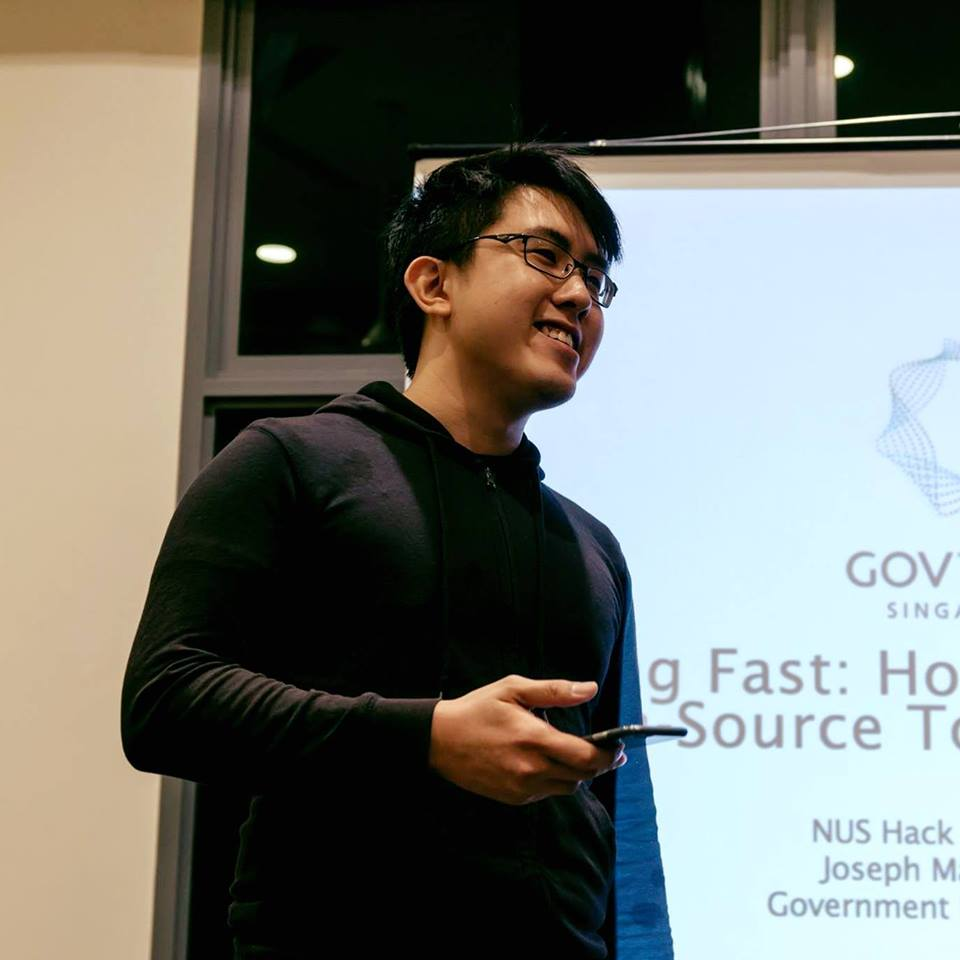

# 👆🏻 Going Beyond Full-Stack Engineering

Being an engineer who's been coached myself, I've experienced how improving soft skills can lead to engineering success and I would like to help other technical people like yourself level up in a stack that you might not be too familiar with - the human stack!

I do this through a series of coaching conversations that combines ontological coaching with my experience working in product teams, helping you to gain clarity over issues you may talk about, who you are, and how you communicate with others.

To book a session/learn more about available packages:



For an in-depth FAQ of what coaching as a discipline technically is:



For more on who I am:



